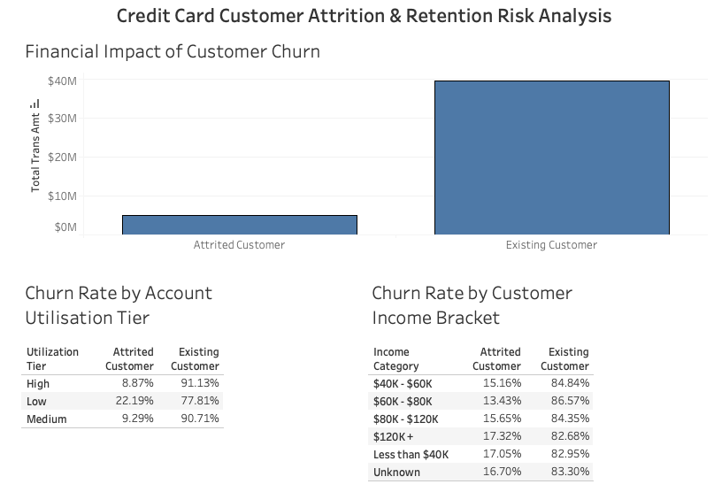

# Bank Customer Churn & Retention Analysis 

## Overview
This project analyses a retail banking dataset using **MySQL** and **Tableau**. The main goal was to understand why customers are leaving the bank (churning) and to calculate the exact financial impact this attrition has on the business.

## Executive Dashboard

I built a Tableau dashboard to visualise my SQL findings clearly and identify the exact behaviours causing customers to leave. 

### Dashboard Preview

*Note: I’ve included a high-resolution snapshot above so you can review the layout and core metrics instantly.*

## What I solved
My biggest hurdle during the preparation phase was structuring the raw metrics so they would make sense visually. To fix this, I engineered a custom database view in SQL that categorised customers into "Low", "Medium", and "High" card utilisation tiers using a `CASE WHEN` statement based on their usage ratios. 

I also used SQL window functions to dynamically calculate customer distribution percentages across different groups, ensuring the foundational metrics were completely accurate when cross-referenced against demographics such as income and age.

## Key Insights & Findings
* **Financial Revenue Leakage:** Attrited customers accounted for over **$4.6 million** in total transaction volume. This represents a huge revenue leak that requires immediate strategic intervention.
* **The Dormancy Trigger:** Card usage is the strongest leading indicator of risk. I discovered that customers in the **Low Utilisation** tier exhibit a huge **22.29% churn rate**, compared to only 8.96% for highly active users.
* **Demographic Stability:** Attrition rates remain relatively flat (hovering between 13% and 17%) across all customer income brackets. This proves that behavioural card usage definitely plays more of a role compared to demographic factors when predicting churn risk.

## How this helps
By identifying exactly where the attrition is triggered, the business can now implement targeted retention campaigns. Specifically, the marketing team can set up automated triggers to incentivise customers as soon as their card utilisation drops into the "Low" tier, potentially saving the account before it closes.

## Tools Used
- MySQL
- DBeaver
- Tableau Public
